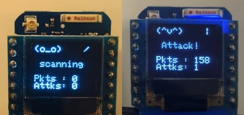

# WiFi DeauthDetector (O_o) 
## a cute deauthentication frames detector with an ESP8266

This project reuses the good ideas from Stefan Kremser's project [DeauthDetector](https://github.com/spacehuhn/DeauthDetector) adding a display to it.

## How it works

It detects [Wi-Fi deauthentication attack](https://en.wikipedia.org/wiki/Wi-Fi_deauthentication_attack) listening on all the wifi channels looking for [Deauthentication framames](https://mrncciew.com/2014/10/11/802-11-mgmt-deauth-disassociation-frames/). It returns the number of detected attacks and deauth packets on an [oled shield](https://wiki.wemos.cc/products:d1_mini_shields:oled_shield) connected to the ESP8266.

## How to install it

You need to:
- Install [Arduino](https://www.arduino.cc/en/Main/Software)
- Install [ESP8266 SDK](https://github.com/esp8266/Arduino)
- Install libraries: `SPI`, `Wire`, `Adafruit_GFX`, `Adafruit_SSD1306`
- Download the code `deaut_detector_oled_shield.ino`
- If necessary personalize the _settings_
- Upload the code to your arduino with ESP8266
